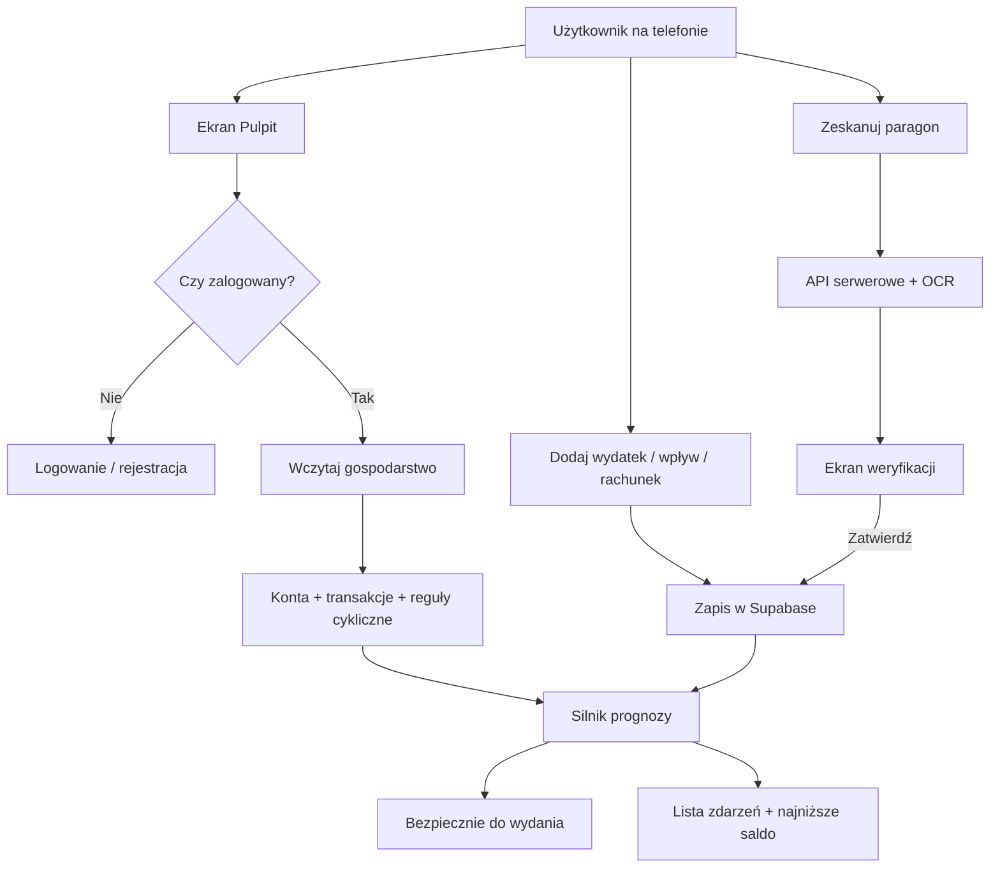

# Etap 0 — Plan aplikacji budżetu domowego

**Data:** 19 lipca 2026  
**Użytkownicy docelowi:** Paweł i Milena  
**Nazwa aplikacji:** Nasz Budżet  
**Nazwa robocza repozytorium:** BudgetPlanner  
**Gospodarstwo demonstracyjne:** Paweł i Milena

Zatwierdzone decyzje: zobacz [DECYZJE.md](./DECYZJE.md).

---

## 1. Uproszczona wizja pierwszej wersji

### Co aplikacja ma robić w pierwszej wersji

Paweł i Milena otwierają aplikację na telefonie i od razu widzą:

> **„Bezpiecznie możecie wydać X zł do dnia Y”**

To nie jest saldo konta bankowego. To kwota po odjęciu rachunków, rezerw i celów, z uwzględnieniem (lub bez) przyszłych wpływów — zależnie od wybranego trybu.

### Co wchodzi do pierwszej wersji (MVP)

| Funkcja | Opis prostymi słowami |
|--------|------------------------|
| Dwa konta | Paweł i Milena logują się osobno |
| Jedno gospodarstwo | Wspólne dane finansowe |
| Konta ręczne | Wspólne, osobiste, gotówka — bez połączenia z bankiem |
| Dochody cykliczne | Pensja miesięczna + przelew tygodniowy |
| Wydatki i rachunki | Jednorazowe i powtarzające się |
| Prognoza | Saldo w czasie, najniższy punkt, ostrzeżenie o braku środków |
| Bezpiecznie do wydania | Trzy tryby: ostrożny / realistyczny / pełna prognoza |
| Kategorie | Gotowa lista + możliwość edycji |
| Analityka | Sumy, kategorie, porównanie okresów |
| Paragony | Zdjęcie → odczyt tekstu → sprawdzenie → zapis |
| PWA | Działa w Safari, można dodać do ekranu iPhone’a |

### Czego NIE ma w pierwszej wersji

- połączenia z bankiem,
- płatności i przelewów,
- inwestycji / kryptowalut,
- powiadomień push,
- wielu walut,
- natywnej aplikacji App Store.

---

## 2. Architektura

### Jak to działa (prosty opis)

```
[Telefon / komputer]
        │
        ▼
[Aplikacja Next.js na Vercel]
  • ekrany (React)
  • logika prognozy
  • bezpieczne endpointy serwerowe (OCR, eksport)
        │
        ▼
[Supabase]
  • baza danych (PostgreSQL)
  • logowanie (Auth)
  • zdjęcia paragonów (Storage)
  • ochrona danych (Row Level Security)
```

### Stack technologiczny

| Element | Technologia | Po co |
|--------|-------------|-------|
| Frontend + API | Next.js (App Router) + TypeScript | Jedna aplikacja: wygląd + logika serwerowa |
| Styl | Tailwind CSS + shadcn/ui | Szybki, spójny wygląd mobilny |
| Formularze | React Hook Form + Zod | Sprawdzanie poprawności wpisów |
| Daty | date-fns + Europe/Warsaw | Polskie daty i cykle wypłat |
| Wykresy | Recharts | Analityka |
| Backend | Supabase | Baza, logowanie, pliki |
| Testy logiki | Vitest | Czy „bezpiecznie do wydania” liczy się dobrze |
| Testy aplikacji | Playwright | Czy rejestracja i gospodarstwo działają |
| Hosting | Vercel | Publikacja w internecie |

### Struktura katalogów (planowana)

```
BudgetPlanner/
├── app/                    # strony i endpointy Next.js
│   ├── (auth)/             # logowanie, rejestracja
│   ├── (app)/              # ekrany po zalogowaniu
│   └── api/                # funkcje serwerowe (OCR, eksport)
├── components/             # elementy interfejsu
│   ├── ui/                 # gotowe komponenty (shadcn)
│   ├── dashboard/
│   ├── transactions/
│   └── forecast/
├── lib/                    # logika współdzielona
│   ├── money/              # grosze, formatowanie PLN
│   ├── forecast/           # algorytm prognozy
│   ├── dates/              # cykle, ostatni dzień roboczy
│   └── supabase/           # połączenie z bazą
├── supabase/
│   └── migrations/         # schemat bazy (SQL)
├── tests/                  # Vitest + Playwright
├── docs/                   # dokumentacja projektu
├── public/                 # ikony PWA, manifest
├── CHANGELOG.md
├── PROJECT_STATUS.md
└── README.md
```

### Przepływ danych (diagram)



---

## 3. Model danych

### Zasada pieniędzy

**Wszystkie kwoty zapisujemy jako liczbę całkowitą groszy.**  
Przykład: `1 250,50 zł` = `125050` groszy.  
Dzięki temu unikamy błędów typu `0.1 + 0.2 ≠ 0.3`.

### Tabele (prosty język)

| Tabela | Co przechowuje |
|--------|----------------|
| `profiles` | Profil użytkownika (imię, ustawienia) |
| `households` | Gospodarstwo domowe |
| `household_members` | Kto należy do gospodarstwa i jaką ma rolę |
| `household_invitations` | Zaproszenia e-mail / kod |
| `accounts` | Konta (wspólne, osobiste, gotówka…) |
| `categories` | Kategorie i podkategorie |
| `income_sources` | Źródła dochodu z cyklem (pensja, przelew tygodniowy) |
| `recurring_rules` | Reguły cyklicznych rachunków |
| `transactions` | Wpływy i wydatki (wykonane i planowane) |
| `transaction_items` | Pozycje z paragonu |
| `planned_expenses` | Planowane wydatki / rezerwacje |
| `budgets` | Limity kategorii (opcjonalnie w MVP) |
| `savings_goals` | Cele oszczędnościowe |
| `goal_contributions` | Wpłaty na cele |
| `receipts` | Metadane zdjęć paragonów |
| `classification_rules` | Reguły kategorii z poprawek użytkownika |
| `audit_logs` | Kto co dodał / zmienił |

### Relacje (skrót)

```
profiles ──┬── household_members ── households
           │
           └── transactions, income_sources, …

households ── accounts
           ── categories
           ── income_sources
           ── recurring_rules
           ── transactions ── transaction_items
           ── savings_goals ── goal_contributions
           ── receipts
           ── classification_rules
```

### Kluczowe pola (wybrane)

**income_sources:** nazwa, właściciel, typowa kwota (grosze), min. bezpieczna kwota, częstotliwość, następna data, pewność (`confirmed` / `expected` / `forecast`), aktywność.

**transactions:** kwota, data, opis, kategoria, kto dodał, kto płaci, wspólny/osobisty, metoda płatności, konto, status (`planned` / `reserved` / `paid` / `cancelled` / `uncertain`).

**accounts:** nazwa, właściciel, typ, saldo początkowe, czy liczone w budżecie wspólnym.  
**Aktualne saldo = saldo początkowe + suma transakcji** (nie osobne „ręczne” saldo do edycji).

### Bezpieczeństwo (RLS)

Każda tabela z danymi gospodarstwa ma politykę:

> Użytkownik widzi i zmienia tylko dane gospodarstw, w których jest członkiem.

Zdjęcia paragonów: prywatny bucket, dostęp tylko przez czasowe linki.

**Migracji SQL jeszcze nie wykonujemy** — najpierw zatwierdzenie tego modelu w Etapie 2.

---

## 4. Lista ekranów

### Przed zalogowaniem

1. Ekran powitalny (krótko: po co jest aplikacja)
2. Rejestracja
3. Logowanie
4. Reset hasła

### Po zalogowaniu — onboarding

5. Utwórz gospodarstwo **lub** dołącz zaproszeniem
6. Szybka konfiguracja: konta + pierwsze źródła dochodu (opcjonalnie pomijalne)
7. Tryb demonstracyjny (opcjonalny, osobne dane)

### Dolna nawigacja

| Pozycja | Ekran |
|---------|--------|
| 1 | **Pulpit** |
| 2 | **Transakcje** |
| 3 | **Dodaj** (menu: wydatek / wpływ / rachunek / paragon) |
| 4 | **Prognoza** |
| 5 | **Więcej** |

### Pulpit

- Karta „bezpiecznie do wydania” + tryb + wyjaśnienie
- Najbliższe zdarzenia
- Najniższe przewidywane saldo
- Skrót wydatków
- Paski kategorii
- Szybkie akcje

### Transakcje

- Lista z filtrami (okres, kategoria, osoba, status)
- Szczegóły transakcji
- Edycja / anulowanie

### Prognoza

- Wybór horyzontu (do wpływu / 7 / 14 / miesiąc / 30 / 90 dni)
- Oś zdarzeń ze saldem po każdym
- Ostrzeżenie o deficycie
- Porównanie trybów

### Więcej

8. Analityka  
9. Źródła dochodu (lista + formularz)  
10. Rachunki cykliczne  
11. Cele oszczędnościowe  
12. Kategorie  
13. Konta  
14. Członkowie i zaproszenia  
15. Ustawienia (tryb domyślny, horyzont, język formatów)  
16. Eksport danych  
17. Usuń konto / dane  
18. Wylogowanie  

### Paragony (Etap 5)

19. Wybór / zdjęcie  
20. Ładowanie OCR  
21. Weryfikacja pozycji i kategorii  
22. Podział kwoty między kategorie  

### Stany wspólne

- Ładowanie, błąd, pusty stan, brak sieci (później PWA)

---

## 5. Algorytm „bezpiecznie do wydania” i prognoza

### Definicje

- **Dostępne środki** = suma sald kont oznaczonych jako „uwzględniaj w budżecie”.
- **Zdarzenie** = wpływ lub wydatek w konkretnym dniu (z transakcji lub wygenerowany z reguły cyklicznej).
- **Horyzont** = do jakiego dnia patrzymy w przyszłość.
- **Nie generujemy** nieskończonej listy przyszłych wpisów w bazie — tylko obliczamy w pamięci na podstawie reguł.

### Generowanie zdarzeń w horyzoncie

1. Weź saldo startowe (suma kont).
2. Dodaj transakcje ze statusem planowany / zarezerwowany / opłacony w okresie (opłacone przeszłe już w saldzie przez historię).
3. Z reguł dochodu wygeneruj wystąpienia do końca horyzontu.
4. Z reguł rachunków wygeneruj wystąpienia.
5. Uwzględnij cele z flagą „zarezerwowane”.
6. Posortuj po dacie.
7. Idź dzień po dniu / zdarzenie po zdarzeniu i licz saldo bieżące.
8. Zapamiętaj minimum salda i jego datę.

### Trzy tryby

| Tryb | Wpływy wliczane | Wydatki |
|------|-----------------|---------|
| **Ostrożny** | tylko `confirmed` (kwota potwierdzona / typowa wg statusu wpływu) | obowiązkowe + rezerwy + cele zarezerwowane |
| **Realistyczny** (domyślny) | `confirmed` + `expected`, ale dla oczekiwanych: **kwota bezpieczna**, nie typowa | typowe koszty + rezerwy |
| **Pełna prognoza** | także `forecast` oraz pełna **typowa** kwota oczekiwanych | jak realistyczny + prognozowane |

**Ważne:**
- wpływy `forecast` nie podbijają „bezpiecznie do wydania” w trybie ostrożnym i realistycznym;
- każde źródło dochodu ma: typową kwotę, minimalną/bezpieczną kwotę, poziom pewności, status konkretnego wpływu;
- tryb realistyczny dla niepotwierdzonych oczekiwanych wpływów bierze **kwotę bezpieczną**.

### Wzór (tryb ostrożny, uproszczenie)

```
bezpiecznie_do_wydania =
  dostępne_środki
  − suma(zarezerwowane zobowiązania do dnia D)
  − suma(planowane konieczne wydatki do dnia D)
  − suma(cele oznaczone jako zarezerwowane)
  + suma(tylko potwierdzone wpływy do dnia D, jeśli ustawienia na to pozwalają)
```

Uwaga: dokładna implementacja liczy **ścieżkę salda w czasie**, a „bezpiecznie do wydania” to zwykle kwota, którą można wydać **dziś**, żeby najniższe saldo w horyzoncie nie spadło poniżej zera (lub poniżej ustawionego bufora).

Prościej dla użytkownika:

> „Jeśli dziś wydasz więcej niż X, to przed dniem Y możecie zejść poniżej zera / poniżej rezerwy.”

### Ostrzeżenie

Jeśli minimum < 0:

> „Przy obecnym planie może zabraknąć około X zł dnia Y.”

### Przypadki brzegowe do przetestowania

- 5 tygodniowych wpływów w jednym miesiącu  
- ostatni dzień roboczy miesiąca  
- luty / rok przestępny  
- opóźniony wpływ  
- anulowany rachunek  
- grosze (np. 10,01 + 0,09)  

---

## 6. Plan etapów

| Etap | Nazwa | Wynik | Stop |
|------|-------|-------|------|
| **0** | Analiza | Plan, model, ryzyka, decyzje | ← **jesteśmy tutaj** |
| **1** | Prototyp lokalny | UI + prognoza bez konta (dane w przeglądarce) | Po uruchomieniu lokalnym |
| **2** | Supabase + auth | Logowanie, gospodarstwo, RLS | Gdy Paweł i Milena widzą te same dane |
| **3** | Pełny budżet | Konta, cykle, tryby, ostrzeżenia | Po testach prognozy |
| **4** | Kategorie + analityka | Wykresy, filtry, limity | Po sprawdzeniu na telefonie |
| **5** | Paragony | OCR + weryfikacja + reguły | Po wyborze OCR (koszt!) |
| **6** | PWA | Manifest, offline, iPhone | Po teście Safari |
| **7** | Vercel + stabilizacja | Produkcja, eksport, instrukcja dla użytkowników | Po checklistie wdrożenia |

**Zasada:** nie zaczynamy kolejnego etapu bez Twojego „start”.

---

## 7. Konta, które trzeba założyć

| Usługa | Po co | Kiedy |
|--------|-------|-------|
| **GitHub** | Kod aplikacji, historia zmian | Przed Etapem 1 lub na jego końcu |
| **Supabase** | Baza, logowanie, zdjęcia | Etap 2 |
| **Vercel** | Publikacja w internecie | Etap 7 |
| **E-mail testowy ×2** | Konta Pawła i Mileny | Etap 2 |

Opcjonalnie później:

| Usługa | Po co |
|--------|-------|
| Dostawca OCR (np. Google Vision / Azure / inny) | Odczyt paragonów — **tylko po porównaniu kosztów** |
| Domena własna | Ładniejszy adres (opcjonalnie) |

---

## 8. Koszty (orientacyjne, 2026)

Ceny się zmieniają — przed rejestracją sprawdzimy aktualny cennik.

| Usługa | Plan darmowy | Kiedy może pojawić się koszt |
|--------|--------------|------------------------------|
| **Supabase** | Tak (Free) — baza, auth, storage z limitami | Więcej użytkowników, dużo zdjęć, większa baza |
| **Vercel** | Tak (Hobby) — wystarczy na start dla 2 osób | Własna domena / wyższe limity |
| **GitHub** | Tak | — |
| **OCR** | Często płatne za stronę/zdjęcie | Etap 5 — wybierzemy najtańszą sensowną opcję lub darmowy limit |
| **Domena** | Nie | ~40–80 zł/rok (opcjonalnie) |

**Dla dwóch osób na start realistycznie: 0 zł/miesiąc**, o ile mieszczą się w limitach Free i OCR jest rzadko używany albo w limicie darmowym.

Elementy bezpłatne na start: hosting Vercel Hobby, Supabase Free, GitHub, biblioteki open source, testy lokalne.

---

## 9. Ryzyka techniczne

| Ryzyko | Dlaczego ważne | Jak łagodzimy |
|--------|----------------|---------------|
| Błędy w liczeniu pieniędzy | Zaufanie do aplikacji | Grosze + testy Vitest |
| Zła konfiguracja RLS | Wyciek danych między gospodarstwami | Testy bezpieczeństwa w Etapie 2 |
| Safari / iPhone PWA | Ograniczenia cache i powiadomień | Etap 6 dedykowany; powiadomienia później |
| OCR słabej jakości | Frustracja przy paragonach | Zawsze weryfikacja ręczna; reguły lokalne |
| Koszt OCR | Niespodzianka na rachunku | Porównanie przed Etapem 5; limit rozmiaru zdjęć |
| Zbyt duży zakres MVP | Projekt się nie kończy | Etapy + stop po każdym |
| Różne cykle wypłat | Trudna logika dat | Osobny moduł + testy lutego/świąt |
| Utrata danych | Finanse | Eksport + backup Supabase w Etapie 7 |

---

## 10. Decyzje — zatwierdzone

Zobacz [DECYZJE.md](./DECYZJE.md). Skrót:

1. Nazwa: **Nasz Budżet**; demo: **Paweł i Milena**
2. Tryb domyślny: **realistyczny** (oczekiwane = kwota bezpieczna)
3. Horyzont pulpitu: **14 dni** + karta kolejnego pewnego wpływu
4. Bufor: tak, demo = 0 zł
5. Cele: tylko zarezerwowane środki
6–10. Etap 1 lokalnie bez e-mail; Git od razu; OCR później; kod EN / UI PL; dane fikcyjne

---

## Elementy uproszczone w pierwszej wersji

- Brak bankowości otwartej (Open Banking)
- Jedna waluta: PLN
- Te same uprawnienia finansowe dla obu członków
- Powiadomienia: brak
- Analityka: solidna, ale bez zaawansowanego ML
- Offline: tylko rozsądny odczyt / komunikat, nie pełna edycja offline
- Audit: podstawowy (kto utworzył / edytował), bez rozbudowanego dziennika prawnego

---

## Checklista przed Etapem 1

- [ ] Przeczytany i zaakceptowany ten plan
- [ ] Podjęte decyzje z sekcji 10 (choćby domyślne)
- [ ] Zainstalowany Node.js (ja podam dokładną komendę sprawdzenia)
- [ ] (Opcjonalnie) konto GitHub
- [ ] Polecenie: „Start Etap 1”
