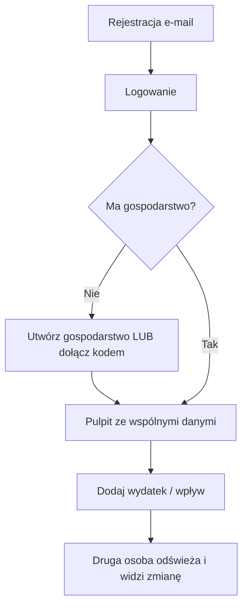

# Etap 2 — Plan: Supabase i logowanie

**Data planu:** 19 lipca 2026  
**Status:** oczekuje na akceptację użytkownika  
**Zakaz do czasu akceptacji:** tworzenie projektu Supabase przez agenta, migracje SQL, klucze w kodzie, logowanie w aplikacji

---

## 1. Cel Etapu 2

Paweł i Milena:

1. zakładają osobne konta (e-mail + hasło),
2. jedno z nich tworzy gospodarstwo (np. nazwa demonstracyjna „Paweł i Milena”),
3. drugie dołącza przez zaproszenie,
4. oboje widzą **te same** dane gospodarstwa,
5. osoba spoza gospodarstwa **nie widzi** cudzych danych.

Dane testowe nadal **fikcyjne** — bez prawdziwych kwot finansowych.

---

## 2. Co wchodzi w Etap 2

| Element | Opis |
|--------|------|
| Projekt Supabase | Baza PostgreSQL + Auth |
| Migracje SQL | Tabele + indeksy + RLS |
| Logowanie / rejestracja | Ekrany po polsku |
| Profile | Imię, powiązanie z kontem Auth |
| Gospodarstwa | Utworzenie + członkowie |
| Zaproszenia | Kod / link (prosty mechanizm) |
| Synchronizacja | Zamiana localStorage → Supabase w warstwie `BudgetRepository` |
| Test bezpieczeństwa | Sprawdzenie, że obcy użytkownik nie czyta cudzego gospodarstwa |

## 3. Czego NIE ma w Etapie 2

- OCR / paragony / Storage zdjęć
- Pełna analityka i limity kategorii
- PWA / Vercel
- Powiadomienia
- Integracja z bankiem
- Automatyczne seedowanie prawdziwych finansów

Lokalny tryb demo (Etap 1) może zostać jako przełącznik „tylko na tym urządzeniu” albo zostać wyłączony po migracji — decyzja przy implementacji (propozycja: zachować reset demo tylko dla niezalogowanych).

---

## 4. Przepływ użytkownika (prosty)



### Role w pierwszej wersji

- **właściciel** — utworzył gospodarstwo; może zapraszać
- **członek** — dołączył; w Etapie 2 **te same uprawnienia finansowe** co właściciel

---

## 5. Schemat bazy — prostym językiem

Wszystkie kwoty = **liczba całkowita groszy** (`integer` / `bigint`).  
Każdy wiersz ma: `id` (UUID), `created_at`, `updated_at`.

### Tabele Etapu 2 (minimum potrzebne do logowania i wspólnych danych)

| Tabela | Po polsku | Po co |
|--------|-----------|-------|
| `profiles` | Profile | Imię, ustawienia użytkownika; 1:1 z kontem Auth |
| `households` | Gospodarstwa | Nazwa, bufor bezpieczeństwa, domyślny tryb/horyzont |
| `household_members` | Członkowie | Kto należy do którego gospodarstwa i jaką ma rolę |
| `household_invitations` | Zaproszenia | Kod, e-mail opcjonalny, ważność, status |
| `accounts` | Konta pieniężne | Wspólne / osobiste / gotówka; saldo początkowe |
| `categories` | Kategorie | Hierarchia (rodzic + dzieci); startowo seed domyślny |
| `income_sources` | Źródła dochodu | Cykl, typowa/bezpieczna kwota, pewność |
| `recurring_bills` | Rachunki cykliczne | Czynsz, media… |
| `transactions` | Transakcje | Wpływy i wydatki |
| `savings_goals` | Cele | Z flagą `reserved` |
| `audit_logs` | Ślad zmian | Kto dodał/edytował (uproszczony) |

### Tabele **odłożone** na później (nie w migracji Etapu 2)

- `transaction_items`, `receipts`, `classification_rules` → Etap 5  
- `budgets`, `planned_expenses`, `goal_contributions` → Etap 3/4 (na razie cele bez osobnych wpłat)

### Relacje (skrót)

```
auth.users
    └── profiles
            └── household_members ── households
                                        ├── accounts
                                        ├── categories
                                        ├── income_sources
                                        ├── recurring_bills
                                        ├── transactions
                                        ├── savings_goals
                                        ├── household_invitations
                                        └── audit_logs
```

### Ważne pola (wybrane)

**households:** `name`, `safety_buffer_grosze` (domyślnie 0), `default_forecast_mode`, `default_horizon_days`

**income_sources:** `typical_amount_grosze`, `safe_amount_grosze`, `confidence` (`confirmed`|`expected`|`forecast`), `frequency`, `next_occurrence_date`

**transactions:** `amount_grosze`, `type`, `status`, `account_id`, `created_by`, `paid_by`, `is_shared`

**household_invitations:** `code` (krótki unikalny), `expires_at`, `accepted_at`, `created_by`

---

## 6. Polityki bezpieczeństwa (RLS) — prostym językiem

**Row Level Security** = baza sama sprawdza przy każdym odczycie/zapisie:  
„Czy ten zalogowany użytkownik należy do tego gospodarstwa?”

### Zasada główna

> Widzisz i zmieniasz **tylko** dane gospodarstw, w których jesteś członkiem.

### Jak to działa w praktyce

1. Po zalogowaniu Supabase zna Twoje `user_id`.
2. Funkcja pomocnicza (np. `is_household_member(household_id)`) sprawdza tabelę `household_members`.
3. Polityki na tabelach finansowych wymagają tej funkcji.
4. **Nie wystarczy** wysłać w żądaniu cudzego `household_id` — baza i tak odmówi.

### Polityki per tabela (zamysł)

| Tabela | Odczyt | Zapis |
|--------|--------|-------|
| `profiles` | Własny profil; podstawowe dane współczłonków tego samego HH | Tylko własny profil |
| `households` | Tylko HH, w których jestem | Update: członek; delete: tylko właściciel (później) |
| `household_members` | Tylko własne HH | Insert przy akceptacji zaproszenia / tworzeniu HH |
| `household_invitations` | Właściciel/członkowie HH; akceptujący po kodzie (ostrożnie) | Tworzenie: członek; akceptacja: zalogowany |
| `accounts`, `income_sources`, `recurring_bills`, `transactions`, `savings_goals`, `categories` | Tylko własne HH | Insert/update/delete: członek HH |
| `audit_logs` | Tylko własne HH | Insert przez aplikację; bez publicznego update |

### Sekrety

| Klucz | Gdzie wolno |
|-------|-------------|
| `NEXT_PUBLIC_SUPABASE_URL` | Przeglądarka (publiczny adres) |
| `NEXT_PUBLIC_SUPABASE_ANON_KEY` | Przeglądarka (ograniczony przez RLS) |
| `SUPABASE_SERVICE_ROLE_KEY` | **Tylko serwer** — nigdy w Git, nigdy w przeglądarce |

Plik `.env.local` lokalnie; w Git tylko `.env.example` bez wartości sekretnych.

---

## 7. Plan implementacji (po akceptacji)

Kolejność pracy agenta (dopiero po Twoim „akceptuję Etap 2” / „Start Etap 2”):

1. Dodać bibliotekę `@supabase/supabase-js` (+ ewentualnie helper Auth dla Next.js) — z krótkim wyjaśnieniem przed instalacją  
2. Pliki `.env.example` + instrukcja wklejenia kluczy  
3. Migracja SQL w `supabase/migrations/` (tekst do wklejenia / CLI)  
4. Ekrany: rejestracja, logowanie, wylogowanie  
5. Onboarding: utwórz gospodarstwo / dołącz kodem  
6. Podmienić `LocalStorageBudgetRepository` → `SupabaseBudgetRepository` (ten sam interfejs)  
7. Przenieść fikcyjne dane demo jako „wczytaj przykładowe dane” dla gospodarstwa (opcjonalny przycisk)  
8. Test: dwa konta, wspólne HH, trzecie konto bez dostępu  
9. Aktualizacja `CHANGELOG.md` + `PROJECT_STATUS.md` + commit

**Stop** po tym, gdy Paweł i Milena (dwa konta testowe) widzą to samo gospodarstwo.

---

## 8. Konta i e-maile do testów

Potrzebujesz:

- 1× konto **Supabase** (firma/projekt),
- 2× adresy e-mail do użytkowników aplikacji (mogą być aliasy Gmail `+`),
- opcjonalnie 3. e-mail do testu „obcy nie widzi danych”.

**Nie** używamy prawdziwych sald ani rachunków — tylko kwoty z dopiskiem „(demo)” / „(test)”.

---

## 9. Koszt Etapu 2

Plan **Free** Supabase zwykle wystarczy dla 2 osób.  
Auth e-mail/hasło w limicie Free.  
Brak Storage w tym etapie → brak kosztów zdjęć.

---

## 10. Ryzyka Etapu 2

| Ryzyko | Łagodzenie |
|--------|------------|
| Źle ustawione RLS | Test trzecim kontem; polityki w migracji, nie „na oko” |
| Wyciek service role | Tylko `.env.local`, gitignore |
| Potwierdzenie e-mail utrudnia testy | Na start: wyłączenie „Confirm email” w Auth (tylko na czas development) — jasno opisane |
| Konflikt localStorage vs chmura | Jedna warstwa repozytorium; jasny wybór źródła danych |

---

## 11. Decyzje do potwierdzenia przed kodowaniem

Propozycje domyślne — napisz, jeśli zmieniasz:

1. **Auth:** e-mail + hasło (bez Google na start) — **tak**?  
2. **Confirm email:** wyłączyć w development — **tak**?  
3. **Zaproszenie:** krótki kod (np. 8 znaków) do wpisania — **tak**?  
4. **Po Etapie 2:** localStorage demo zostaje dla gościa / tylko zalogowani — propozycja: **tylko zalogowani + przycisk „wczytaj dane demo”**  
5. **Region Supabase:** Europa (np. Frankfurt), jeśli dostępny — **tak**?

---

## 12. Kryterium ukończenia Etapu 2

- [ ] Dwa konta mogą się zarejestrować i zalogować  
- [ ] Wspólne gospodarstwo po zaproszeniu  
- [ ] Wspólne transakcje widoczne u obu  
- [ ] Trzeci użytkownik nie widzi tego gospodarstwa  
- [ ] Klucze nie są w Git  
- [ ] Dokumentacja zaktualizowana  

---

## Akceptacja

Napisz np.:

> Akceptuję plan Etapu 2. Konto Supabase mam. Start Etap 2.

Dopiero wtedy tworzymy projekt w panelu (Ty) / migracje i kod (agent).
